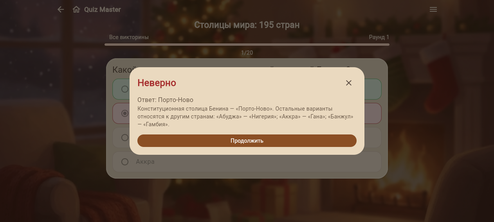
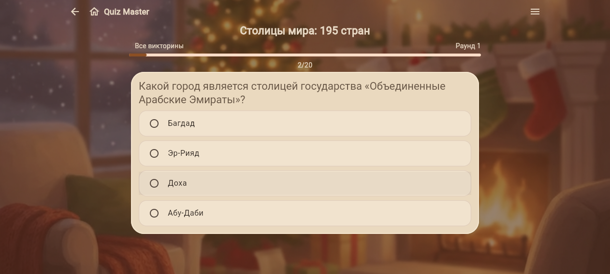
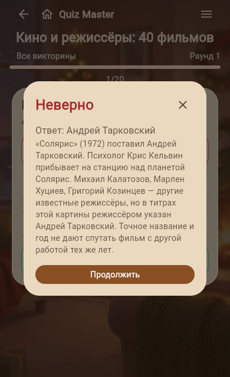

# Полный банк столиц — техническая интеграция

195 стран: 193 члена ООН и два наблюдателя. Источник и варианты на русском,
15 оговорённых случаев; distractors исключают неоднозначные столичные функции.
Обычная игровая сессия по-прежнему выбирает до20 вопросов из большого банка.

Независимая приёмка: PREPARATION_CAPITALS_WORLD_REVIEW.md, финальный source hash
`7dcb15b820f18649a5d8fbc7adebac18fdff1dfda49fba70fe8d0e15fa891ccd`.
Исправлены потеря функций в объяснениях и английские display-названия; скрытые
источниковые идентификаторы остаются отдельно. Исправления генератора проверены
независимо; запуск генератора и его assertions завершился кодом0.

Реальные quizctl import/build/validate выполнены для
quizzes/Preparation/prep_capitals_world.json → next/content/prep-capitals-world.
Source canonical SHA `696b25cec11a2c671e555f9b5c93a2b5250d075564527e431afbaec104cf6842`;
bundle SHA `d1d4a75ac2bec53b7017f95b0ac7021de1b8b5dd51e0d35168ead7b253e7aba3`.
Отдельная проверка всех195 записей подтверждает сохранение правильных option IDs
и объяснений в manifest/reveal.

Текущий репозиторий:105 наборов /3403 вопросов, включая новый банк режиссёров40.
Каталог заново экспортирован только с пятью публичными metadata-полями.
Свежие gates: go test -p=1 ./... —10 пакетов PASS; Flutter test --no-pub —52 PASS.
Go collection integration действительно проходит все3403 ответа, завершает
каждый из105 наборов и проверяет историю после рестарта на временной SQLite.

## Подтверждённая выкладка 2026-10-03

Исходники интеграции committed/pushed `ebab492`. Живой build:
`quiz-2026.10.03-capitals-ebab492`, Helm revision15, namespace quiz-master.
Image digest `sha256:e1f70688b605de126352efa35ce662146b969ce975ac452d18ff39f631203415`.
API SHA `47353a2844f12e3749da84cd13942d98dfb1fbe478d341f8370106ef0b026764`;
Web SHA `28a5daf5cfc95f6f5d09265b5b16c3cec9d0198be0e9853bafc27818a7ef97f5`;
catalog SHA `13a14b882e4e1477afa4430502f3cdf16ac6a007a8ce9ac781bc1c1359b7ad30`.

Удалённый hostname проверен: racknerd-f0269d5. Перед обновлением сделана
онлайн-копия SQLite и проверено восстановление: integrity=ok, restore=ok;
41 участник,443 попытки,104 bundle-записи в копии до релиза.
Проверки checksum, nginx -t, helm lint --strict и server dry-run прошли;
helm upgrade --atomic --wait завершён успешно. Pod2/2 Running,0 рестартов,
старый PVC `pvc-7fc2428f-4146-4c78-a26d-2347d9f3b7bf` сохранён.
Для отката — Helm revision14, без восстановления старой БД поверх живой.
Локальный Docker, PostgreSQL и GitHub Actions не запускались.

После выкладки отдельные HTTP assertions подтверждают:

- `/v1/catalog?quiz_id=prep-capitals-world`:195 вопросов;
- `/v1/catalog?quiz_id=prep-film-directors-1`:40 вопросов;
- ни один из этих публичных ответов не содержит grading/correct_option_id/
  correct_answer/explanation;
- живой `/assets/assets/catalog.json` — массив105 наборов, сумма
  questions_count=3403, а не только значения вручную записанного version.json.

Реальный Chromium smoke: банк столиц открывается с перемешанными вопросами и
вариантами, индикатор1/20; неправильный ответ показывает центральное окно с
правильным ответом и объяснением; «Продолжить» переводит на2/20.
Проверен в том числе оговорённый случай конституционной столицы Бенина.
На viewport390×640 банк режиссёров открывает20-вопросный раунд; вопрос о
«Солярисе» и объяснение о Тарковском находятся в пределах экрана.
Browser errors пусты. Только собственные browser sessions закрыты после smoke.

Диагностические попытки wait --text «Неверно» не являются успешными gates:
эта визуальная метка отсутствует в полученном accessibility snapshot, где есть
dialog, ответ и кнопка «Продолжить». После завершения анимации проверены
фактический screenshot, snapshot диалога и переход на2/20. Ранние неверные
assertions по форме каталога исправлены: источник — массив с questions_count.
Android/device,20 последовательных ответов в продакшен-браузере и все остальные
культурные банки этим smoke не заявляются проверенными.

Флаги и книги имеют отдельные редакционные gates. Общий план культурной
библиотеки остаётся незавершённым; этот релиз добавляет235 вопросов к ранее
опубликованным40 новым вопросам, всего275 новых проверенных вопросов.
