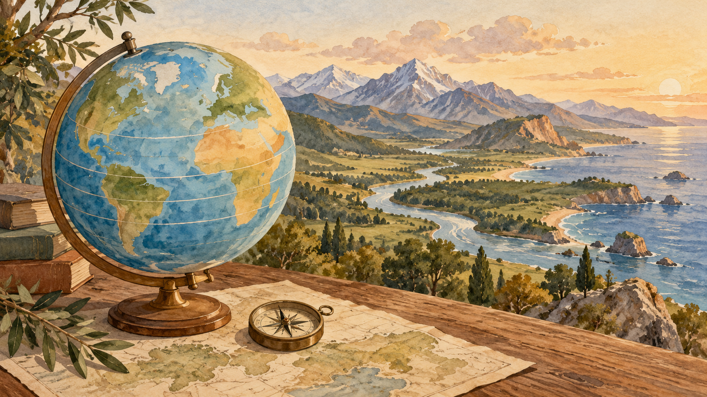

# География и страны: как читать мир, а не зубрить пары

Почему на привычной настенной карте Гренландия кажется сравнимой с Африкой, хотя это не так? И почему ответ «это в Европе» иногда полезен, а иногда вводит в заблуждение? География становится живой, когда карта перестаёт быть фоном для викторины: она показывает масштаб, положение, связи и границы — но всегда делает это с выбранными правилами.

## Два слоя одной карты

Физическая география спрашивает о рельефе, климате, реках, океанах и широтах. Политическая — о государствах, границах, столицах и административных единицах. Слои постоянно взаимодействуют: горный хребет может осложнить сообщение, пролив — сделать порт важным, а река — стать частью границы. Но они не равны друг другу. Государственная граница — не «естественная линия на земле» по определению: она является политико-правовым соглашением и может пересекать пустыню, лес или равнину.

Поэтому в вопросе сначала назовите тип факта. «На какой широте?» — координаты. «Какой город выполняет законодательную функцию?» — политическое устройство. «Почему здесь влажнее?» — физический процесс. Эта короткая пауза защищает от самого частого квизового промаха: отвечать столицей на вопрос о крупнейшем городе или путать континент со статусом государства.

## Координаты: адрес, а не оценка расстояния

Широта отсчитывается к северу или югу от экватора, долгота — к востоку или западу от нулевого меридиана. Пара координат задаёт положение точки. Линии равной широты — параллели; линии равной долготы — меридианы [NOAA: широта](https://oceanservice.noaa.gov/facts/latitude.html), [NOAA: долгота](https://oceanservice.noaa.gov/facts/longitude.html). Две точки на одной широте не обязаны иметь одинаковый климат: на него влияют высота, океанические течения, рельеф и сезонные ветры; этот набор местных факторов приводит NWS [NWS](https://www.weather.gov/media/ilm/Newsletter/WilmingtonWave_Fall_2018.pdf). И наоборот, одинаковая долгота не делает места соседними — меридиан тянется от полюса к полюсу.

Координаты лучше читать как два вопроса: «насколько далеко от экватора?» и «в каком направлении вокруг Земли?». Для грубой оценки маршрута нужен ещё масштаб и форма Земли. Плоская карта удобна, но не превращает прямую на бумаге автоматически в кратчайший путь по поверхности.

## Любая мировая карта что-то искажает

Масштаб — отношение длины на карте к соответствующей длине на местности [USGS, раздел Linear scale на странице 2](https://store.usgs.gov/assets/mod/storefiles/PDF/16573.pdf). Для масштаба 1:100 000 один сантиметр представляет 100 000 сантиметров, то есть один километр. Поэтому отрезок в три сантиметра соответствует трём километрам. Это расчёт длины отрезка по масштабу, а не обещание, что дорога между точками будет такой же короткой: маршрут может огибать гору или реку.

Глобус лучше передаёт форму всей Земли. Когда шар разворачивают на плоскость, невозможно одновременно сохранить без искажений площади, расстояния, направления и формы. USGS подчёркивает: «лучшей» для всех задач проекции нет; её выбирают под задачу [USGS](https://store.usgs.gov/assets/mod/storefiles/PDF/16573.pdf).

Проекция Меркатора полезна для навигационной задачи: линия постоянного направления изображается прямой. Но площади и расстояния у высоких широт сильно преувеличиваются. Поэтому Гренландия на такой карте выглядит несоразмерно большой. Это не ошибка картографа, а цена выбранного свойства. Для сравнения площадей нужна равновеликая проекция; для ощущения планеты — глобус.

| Инструмент | Хорошо отвечает | Чего не обещает |
|---|---|---|
| Глобус | общую форму и взаимное положение | удобного мелкого чтения деталей |
| Карта Меркатора | постоянное направление | верные площади у полюсов |
| Равновеликая карта | сравнение площадей | сохранение всех локальных форм |
| Топографическая карта | рельеф и детали местности | обзор всего мира |

## Страна, территория, регион: слова разной точности

В разговоре «страна» часто покрывает всё сразу. В статистике и международной работе важно уточнять набор. Стандарт M49 ООН даёт числовые коды для стран или территорий и отдельные буквенные ISO-коды; он служит стандартизации статистических данных, а не «табелем важности» [UNSD](https://unstats.un.org/unsd/methodology/m49/?hl=en-GB). Регионы ООН также нужны для сопоставимых данных: каждая страна или территория показана только в одном таком регионе, но это не отменяет культурных, исторических или геологических способов деления мира.

Опасна и привычка автоматически считать «развитый» и «развивающийся» географическими ярлыками. На странице M49 прямо сказано, что у системы ООН нет единого определения этих категорий; прежние группировки предназначались для статистического удобства и не выражали оценку стадии развития. В хорошем вопросе следует назвать систему классификации и дату.

## Границы продолжаются в море

Карта государства не заканчивается у береговой линии. Конвенция ООН по морскому праву задаёт для исключительной экономической зоны верхний предел: не более 200 морских миль от исходных линий. Это не «кусок моря, который страна может закрыть для всех»: другие государства сохраняют предусмотренные Конвенцией свободы судоходства, полётов и прокладки кабелей [ООН](https://www.un.org/Depts/los/convention_agreements/texts/unclos/part5.htm). В узких морях зоны соседей требуют разграничения, поэтому нельзя рисовать вокруг каждого берега одинаковую идеальную окружность.

## Столица — функция, а не конкурс известности

Столица может быть административной, законодательной или судебной; крупнейший город может не быть ни одной из них. Южная Африка наглядно распределяет эти функции между Преторией, Кейптауном и Блумфонтейном, а официальный портал отдельно называет Йоханнесбург столицей провинции Гаутенг [gov.za](https://www.gov.za/about-sa/south-africas-provinces). Вопрос «какая столица?» без уточнения иногда всё ещё имеет один принятый ответ, но вопрос «где парламент?» требует другой логики. Сначала прочтите роль города, потом вспоминайте имя.

## Пять ловушек карты

1. **Крупнее на карте ≠ больше по площади.** Проверьте проекцию.
2. **Один регион ≠ единая культура или политика.** Это может быть статистический контейнер.
3. **Широта ≠ климат сама по себе.** Важны также высота, океан и рельеф.
4. **Крупнейший город ≠ столица.** Спросите, о какой функции речь.
5. **Берег ≠ конец географии государства.** Есть морские зоны с разными режимами.

## Активное вспоминание и повторение

1. Назовите одно преимущество и одно искажение Меркатора.
2. Объясните разницу между широтой и долготой без жестов.
3. Почему классификация ООН не равна культурной карте мира?
4. Чем исключительная экономическая зона отличается от закрытого моря?
5. Придумайте вопрос, где крупнейший город был бы плохой подсказкой к столице.

Повторяйте модуль в трёх масштабах. Сначала на глобусе найдите экватор, полюса и пару меридианов. Затем на карте объясните одно искажение. Наконец, прочитайте вопрос о стране и вслух назовите, к какому слою он относится: координаты, рельеф, граница, статус или функция города. Эта привычка превращает запоминание пар в ориентирование.
