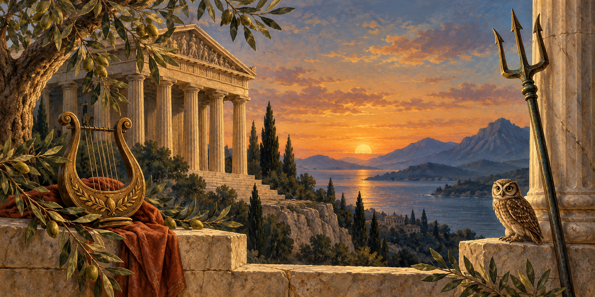

# Древнегреческая мифология: карта сюжетов, а не список имён

**Почему у Афины может быть несколько историй о рождении, а у Гефеста — разные родители?** Потому что греческий миф — не единая «книга правил». Это множество устных и письменных традиций, исполнявшихся в разных местах и эпохах. Античные авторы иногда прямо отмечают варианты. Поэтому мифы изучают как рассказы и часть религиозной культуры древних греков, а не как установленную историю мира.

## 1. Сначала назовите версию

Фраза «по греческому мифу» слишком широка. Лучше: «в *Теогонии* Гесиода», «в гомеровском гимне», «у Псевдо-Аполлодора». *Теогония* — поэма о происхождении и родстве богов, а «Библиотека» Псевдо-Аполлодора — более поздняя компиляция, собравшая разные сюжеты [Гесиод](https://www.theoi.com/Text/HesiodTheogony.html), [Псевдо-Аполлодор](https://www.theoi.com/Text/Apollodorus1.html). Ни один из этих текстов не является протоколом события.

Это не делает рассказы «бесполезными»: они показывают язык образов, культ, политику и воображение обществ, которые их передавали. Вопрос квиза должен поэтому спрашивать не «что *на самом деле* сделал бог», а «кто действует в названной версии».

## 2. Три поколения как скелет карты

В версии Гесиода первыми появляются Хаос, Земля-Гея, Тартар и Эрос. Затем из связи Геи и Урана происходят Титаны. Самый младший из них, Кронос, свергает Урана; потом Кронос глотает своих детей, опасаясь такого же переворота. Рея спасает Зевса. Повзрослевший Зевс освобождает братьев и сестёр, и после войны с Титанами устанавливается олимпийский порядок.

Схема полезнее длинной родословной:

| Уровень в рассказе | Примеры | Главный конфликт |
|---|---|---|
| Первичные силы | Хаос, Гея, Тартар | возникновение мира и поколений |
| Титаны | Кронос, Рея, Океан | смена власти |
| Олимпийцы | Зевс, Гера, Афина, Аполлон | распределение сфер и отношения людей с богами |

В книге 1.2.1 Псевдо-Аполлодора освобождённые циклопы снабжают братьев оружием: Зевсу дают гром и молнию, Аиду — шлем, Посейдону — трезубец. После победы над Титанами братья распределяют владения по жребию: Зевсу достаётся небо, Посейдону — море, Аиду — подземный мир [книга 1](https://www.theoi.com/Text/Apollodorus1.html). Это **не** означает, что Аид — «греческий дьявол»: он правитель царства умерших, а не противник Зевса по умолчанию.

## 3. Атрибут — подсказка, не паспорт

На вазе или статуе трезубец обычно ведёт к Посейдону, лук — к Артемиде или Аполлону, крылатый жезл — к Гермесу. Но изображение надо читать вместе с контекстом: бог может иметь несколько функций, а художник — свой замысел. Музейные описания связывают богов не только с «суперсилами», но и с культом, праздником, городом и конкретным предметом [Met](https://www.metmuseum.org/essays/greek-gods-and-religious-practices).

Римские имена — не отдельная панель «тех же персонажей». Римляне отождествляли многих богов с греческими: Зевс — Юпитер, Гера — Юнона, Афина — Минерва, Гермес — Меркурий, Афродита — Венера. Но римский культ, литература и политический смысл могли отличаться. В квизе сначала выясните: спрашивают греческое имя или римское соответствие?

## 4. Герои живут в циклах

Мифический герой — не обязательно исторический человек. Герои объединены задачами и местами: Ясон и аргонавты ищут золотое руно; Беллерофонт побеждает Химеру [Псевдо-Аполлодор, книга 2](https://www.theoi.com/Text/Apollodorus2.html); Кадм связывается с основанием Фив [книга 3](https://www.theoi.com/Text/Apollodorus3.html); Тесей — с Афинами и Критом; Геракл — с подвигами; фиванский круг ведёт к Эдипу и его детям. Один персонаж может появляться и в чужом цикле, поэтому запоминайте не только имя, но и пару «герой — задача».

Троянский цикл шире *Илиады*. У Гомера *Илиада* начинается с гнева Ахилла во время войны, а не с деревянного коня и не с падения Трои. *Одиссея* строится вокруг долгого возвращения Одиссея домой после войны [*Илиада*](https://www.theoi.com/Text/HomerIliad1.html), [*Одиссея*](https://www.theoi.com/Text/HomerOdyssey1.html). Это простая защита от квизовой ловушки «всё троянское — в одной поэме».

## 5. Вариант меняет честный ответ

У Псевдо-Аполлодора Гефест рождается у Геры без союза с Зевсом; автор тут же отмечает, что у Гомера он ребёнок обоих. В его же рассказе Орфей убеждает владыку подземного мира вернуть Эвридику, но не должен оглядываться, пока не придёт в свой дом; он оглядывается и теряет её. Это не ошибка составителя: вариант — часть материала, а не помеха.

То же с Персефоной. В гомеровском гимне к Деметре её история объясняет отношения матери, дочери, подземного мира и плодородия; поздние пересказы часто превращают её в одну «сказку о временах года». Гимн — поэтический и религиозный текст, а не метеорологический отчёт.

## 6. Как решать мифологический вопрос

Подчеркните ограничитель: «у Гесиода», «в *Илиаде*», «в римской традиции», «на изображении». Затем определите тип связи: родство, атрибут, действие, место или цикл. Наконец, исключите ловушку: имя из другого языка, герой из соседнего сюжета, поздняя привычная формула вроде «ящика Пандоры» вместо сосуда у Гесиода.

## Частые путаницы

- Титан ≠ любой великан; это поколение богов в конкретной генеалогии.
- Олимпиец ≠ обязательно ребёнок Зевса.
- Греческое имя ≠ римское имя, хотя у них может быть соответствие.
- Сюжет поэмы ≠ вся история войны или героя.
- Вариант мифа ≠ «неправильная версия», если назван источник.

## Проверьте себя

1. Назовите три уровня схемы «первичные силы — Титаны — Олимпийцы».
2. Какой вопрос вы зададите перед ответом о рождении Афины?
3. Соотнесите: Ясон — ?, Беллерофонт — ?, Орфей — ?.
4. Как отличить греческое имя от римского в формулировке вопроса?
5. Чем *Илиада* отличается от всего Троянского цикла?

## Повторение

Через день восстановите по памяти схему поколений и пять греко-римских пар. Через неделю выберите один древний отрывок: выпишите, что в нём сказано буквально и где начинается ваш пересказ. Затем пройдите раунд, называя вслух источник или версию, когда это важно. Дальше читайте гимны и эпос целыми эпизодами — так персонажи перестают быть карточками с именами.
