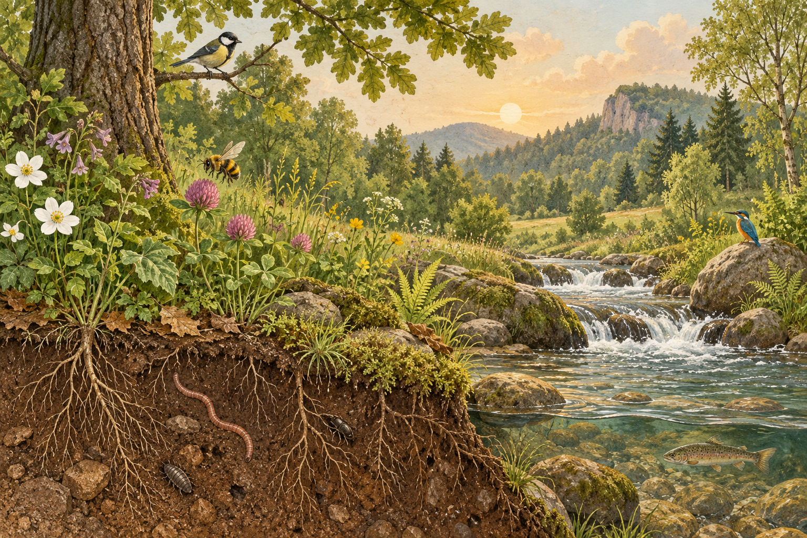

# Природа: связи, которые работают незаметно

Почему исчезновение неприметного животного иногда меняет весь ландшафт, а цепочка вулканических островов может рассказать о движении океанической плиты? Квиз о природе становится интереснее, когда рекорд или красивое название превращается в объяснение. Здесь главное правило такое: природа — не набор отдельных «фактов о животных», а сеть процессов, в которой причина часто находится не там, где заметен результат.

## Эволюция — не личное усилие

У слова «приспособился» есть опасная бытовая ловушка. Отдельная лисица не отращивает нужную шерсть потому, что решила жить на снегу. В популяции уже есть наследуемые различия. Если в конкретных условиях особи с некоторым признаком чаще оставляют потомство, этот вариант признака с поколениями может стать обычнее. Так естественный отбор описывает изменение **популяции**, а не сознательную тренировку одной особи.

Полезно отделять это от акклиматизации. Когда человек на высоте учащает дыхание, это реакция организма в течение жизни; CDC описывает постепенное увеличение вентиляции в первые дни высотной акклиматизации [CDC](https://www.cdc.gov/yellow-book/hcp/environmental-hazards-risks/high-altitude-travel-and-altitude-illness.html). Его дети не получают эту реакцию автоматически как готовую наследственную черту. А эволюционное приспособление требует поколений и наследования. Поэтому правильный вопрос к любому примеру: «Меняется организм сейчас или доля наследуемого варианта в популяции?»

## Экосистема: не только кто кого ест

Экосистема включает живые организмы и неживые условия: свет, воду, почву, температуру. Растение использует энергию света, травоядное получает энергию, поедая растение, хищник — поедая травоядное. Но вещество не исчезает в конце стрелки: разлагатели возвращают соединения в почву и воду. Энергия же на каждом переходе частично рассеивается как тепло, поэтому пищевая сеть обычно не строится из бесконечного числа уровней. EPA описывает экосистему как взаимодействие организмов и физической среды, а разложение — как возврат минеральных компонентов в почву [EPA](https://nepis.epa.gov/Exe/ZyPURL.cgi?Dockey=40000IKE.TXT).

| Что проходит через систему | Как ведёт себя | Пример |
|---|---|---|
| Энергия | входит главным образом как солнечный свет и рассеивается как тепло | свет → трава → заяц |
| Вещество | многократно переходит и возвращается в круговороты | вода, углерод, минеральные соли |
| Информация | задаётся наследственностью и поведением, но не является «потоком пищи» | миграционный маршрут птиц |

Слово «ключевой вид» не означает «самый большой» или «самый симпатичный». Это вид, от которого сильно зависят другие связи: при его удалении система заметно перестраивается. Служба национальных парков определяет ключевой вид через непропорциональное влияние на устойчивость других видов и состав сообщества [NPS](https://www.nps.gov/articles/parkscience31-1_eckert-plumb.htm). Это не универсальный титул для всех мест, а вывод о роли в определённой сети.

## Круговорот воды — маршрут без старта

У круговорота воды нет единственного «первого кадра». Солнце испаряет воду с поверхности, растения добавляют влагу транспирацией, в более холодном воздухе пар конденсируется, а затем выпадает осадками. Дальше вода может стекать в реку, просачиваться в грунт и пополнять водоносный горизонт либо снова испаряться. Солнце и гравитация поддерживают это непрерывное перемещение [USGS](https://www.usgs.gov/special-topics/water-science-school/water-cycle).

Здесь частая путаница: облако — не «готовая пресная вода из моря». Морская соль в обычном испарении остаётся в воде, но капли облака могут затем собрать загрязнения из воздуха. И ещё: вода под землёй не обязательно течёт быстрыми подземными реками; значительная её часть находится в порах и трещинах пород.

## Риф — партнёрство под давлением

Коралл — животное, а не растение и не камень. Риф строят колонии коралловых полипов с твёрдым известковым скелетом; с ними связаны микроскопические водоросли-симбионты [NOAA: биология кораллов](https://oceanservice.noaa.gov/facts/coral.html). При сильном тепловом стрессе кораллы могут терять этих симбионтов — это обесцвечивание. Обесцвеченный коралл не обязательно сразу погиб, но его риск гибели возрастает. NOAA также указывает: поглощённый океаном CO₂ меняет химию воды, снижает pH и уменьшает скорость кальцификации рифостроящих организмов [NOAA](https://oceanservice.noaa.gov/facts/coralreef-climate.html).

Это хороший пример того, почему один эффект не стоит путать с другим: потепление связано с тепловым стрессом, а закисление — с изменением химии воды. Оба процесса могут действовать одновременно.

## Земля движется медленно, последствия — быстро

Литосфера разбита на плиты, которые расходятся, сталкиваются или скользят мимо друг друга. На границах особенно часто сосредоточены землетрясения и вулканы. При субдукции одна плита погружается под другую; возле срединно-океанических хребтов плиты расходятся. Но «все вулканы только на границах» — неверно: Гавайская цепь объясняется движением Тихоокеанской плиты над горячей точкой [USGS](https://pubs.usgs.gov/gip/volc/tectonics.html). Сопоставьте возраст островов и направление движения плиты — и увидите историю вместо списка названий.

## Когда вид оказывается не на своём месте

Неместный вид — не автоматически вредный. Инвазивным его называют, когда после попадания в новый регион он вызывает ущерб окружающей среде, экономике или здоровью. Распространяясь, он может менять среду и вытеснять местные виды. Именно такое различие проводит Национальная парковая служба США [NPS: определения и примеры](https://www.nps.gov/subjects/invasive/what-are-invasive-species.htm). Поэтому фраза «чужой вид всегда плох» слишком груба, а вопрос о последствиях требует конкретного места и механизма.

## Пять путаниц, которые стоит ловить

1. **Эволюция ≠ изменение одного организма за жизнь.**
2. **Ключевой вид ≠ обязательно крупнейший хищник.**
3. **Пищевая цепь ≠ вся экосистема:** реальность чаще похожа на сеть.
4. **Обесцвечивание коралла ≠ немедленная гибель,** но это тревожный стрессовый сигнал.
5. **Вулкан ≠ всегда граница плит:** существуют горячие точки.

## Проверьте себя и повторите

1. Назовите два отличия эволюционного изменения от акклиматизации.
2. Продолжите маршрут капли после дождя тремя разными путями.
3. Почему удаление ключевого вида может затронуть не только его добычу?
4. Какие два механизма угрожают рифу при росте CO₂?
5. Почему Гавайи — исключение к правилу «вулканы у границ»?

При повторении сначала нарисуйте от руки три схемы: пищевую сеть, маршрут воды и три типа границ плит. Через день решите вопросы без статьи; через неделю объясните один пример вслух, не называя термин сразу. Если объяснение держится на причине и следствии, а не на одном слове, оно переживёт и незнакомый вопрос.
